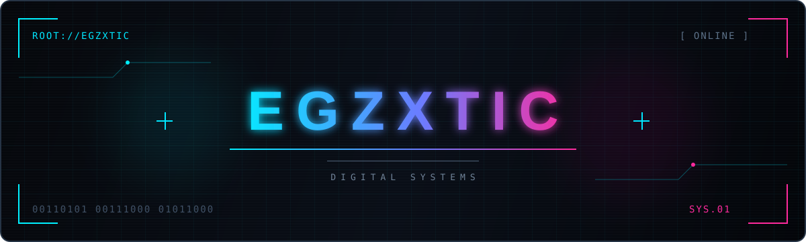

<div align="center">


<br/>


<br/>

```text
[CORE] STACK ONLINE
[MODE] DARK TECH AESTHETIC
[CHANNEL] CREATIVE + DEVELOPMENT
[STATE] CONNECTED
```


<br/>
<br/>

<a href="https://dc.skam.club"></a>
<a href="https://instagram.com/egzxtic"></a>
<a href="https://www.youtube.com/@egzxtic"></a>
<a href="https://www.behance.net/egzotic"></a>

<br/><br/>


<br/><br/>


<br/>


</div>
